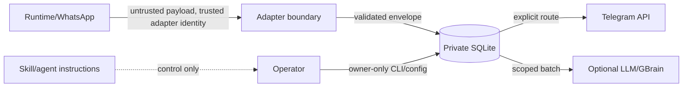

# Threat Model — Espelho Zap Portable

**ID:** THREAT-ESPELHO-ZAP-PORTABLE-001
**Tipo:** modelo de ameacas
**Status:** modelo ativo; controles dependem dos testes de aceite
**Dono:** Maintainer
**Escopo:** WhatsApp Cockpit
**Fonte canonica:** sim, para controles de seguranca do produto
**Fonte superior:** `ARCHITECTURE.md`
**Pai:** `ARCH-ESPELHO-ZAP-PORTABLE-001`
**Filhos:** testes negativos em `ACCEPTANCE_TESTS.md`
**Relacionados:** governanca private workspace de privacidade; issues #171/#176
**Substitui:** nenhum
**Substituido por:** nenhum
**Sensibilidade:** L1; nao contem segredos ou destinos reais
**Ultima revisao:** 2026-08-04

## 1. Objetivo e postura

Proteger confidencialidade, integridade, disponibilidade e continuidade das conversas capturadas. O produto nao promete impedir toda falha externa; promete reduzir superficie, falhar fechado em ambiguidade e manter prova/rollback.

## 2. Ativos

- eventos e cursores canonicos;
- rotas conversa -> forum topic;
- midia temporaria;
- claims/evidencias e scopes;
- credenciais Telegram e sessoes WhatsApp pertencentes ao host;
- lease single-writer;
- outbox/delivery state;
- pacotes de instalacao, config e backups;
- continuidade entre origem e destino.

## 3. Fronteiras de confianca

Payload de mensagem e sempre nao confiavel, mesmo vindo de contato conhecido. Adapter e confiavel apenas para afirmar sua identidade/capabilities, nao para escolher permissao ou destino.

## 4. Atores

- dono/operador autorizado;
- gestor/remetente WhatsApp;
- runtime OpenClaw/Hermes;
- Telegram e provedores externos;
- agente/LLM potencialmente induzido por prompt;
- processo concorrente ou instalacao antiga;
- atacante local com acesso parcial;
- pacote/upgrade adulterado.

## 5. Ameacas e controles

| ID | Ameaca | Impacto | Controles obrigatorios | Teste |
| --- | --- | --- | --- | --- |
| TM-01 | conversa entregue no topico errado | vazamento entre pessoas/areas | route key opaca; mapping explicito; sem guess; teste cruzado | AT-ROUTE-01..04 |
| TM-02 | fallback para DM | mistura control/data plane | API de delivery exige `chat_id + thread_id`; sem default/last chat | AT-PLANE-01 |
| TM-03 | replay/duplicata | ruido, exposicao repetida, custo | event PK; outbox unique; dedupe historico; restart tests | AT-IDEM-01..03 |
| TM-04 | timeout ambiguo e retry cego | duplicata nao detectavel | estado `uncertain`; retry apenas com prova de nao-envio | AT-DELIVERY-03 |
| TM-05 | segundo writer | dois pollers/entregadores | lease; preflight de processo; cutover sequencial | AT-LEASE-01 |
| TM-06 | auto-reply WhatsApp | agente se intromete em conversa | forum fora da LLM; allowlist humana; bridge generico 405; endpoint dedicado autenticado | AT-OUTBOUND-01 |
| TM-07 | descricao/OCR/vision visivel | conteudo alterado e processamento indevido | scope guard no host + media policy defensiva | AT-MEDIA-02 |
| TM-08 | audio convertido/truncado | perda de fidelidade | voice->sendVoice; audio->sendAudio; hash e playback | AT-MEDIA-03 |
| TM-09 | legenda truncada silenciosamente | perda de contexto | validar limite; erro/gate ou estrategia versionada | AT-MEDIA-05 |
| TM-10 | path traversal/symlink/hardlink | leitura/escrita fora do spool | resolve/no-follow; regular file; allow roots | AT-FS-01 |
| TM-11 | arquivo muda durante envio | conteudo/hash incoerente | stat/hash antes/depois; handle seguro; quarentena | AT-FS-02 |
| TM-12 | disco cheio por midia | parada/corrupcao | quotas; warning/hard stop; purge pos-ACK; nunca delete aleatorio | AT-DISK-01 |
| TM-13 | segredo em config/log/pacote | tomada de canal/conta | secret store/env; redaction; scanner; owner-only | AT-SECRET-01 |
| TM-14 | DB legivel por terceiros | vazamento de conversas | dirs 0700; files 0600; usuario dedicado | AT-PERM-01 |
| TM-15 | migracao sobrescreve Captura V2 | perda/corrupcao | tabelas `mirror_*`; migracoes aditivas; sem `PRAGMA user_version` global | AT-DB-02 |
| TM-16 | schema downgrade/futuro | interpretacao errada | schema versions; fail closed antes de gravar | AT-DB-03 |
| TM-17 | cursor errado/truncamento de fonte | replay ou lacuna | generation fingerprint; watermark; coverage report | AT-MIG-02 |
| TM-18 | prompt injection roteia/autoriza | vazamento/mutacao | LLM fora de auth/route/ACK; payload como dado | AT-PROMPT-01 |
| TM-19 | claim rebaixa privacidade | vazamento no segundo cerebro | monotonic scope; evidence obrigatoria; filter pre-LLM | AT-SCOPE-01 |
| TM-20 | GBrain vira fonte canonica | perda ao reindexar | ledger/claims canonicos; indice reconstruivel | AT-CONSUMER-03 |
| TM-21 | consumer falha e bloqueia captura | perda de eventos | cursores separados; bounded batches | AT-CONSUMER-01 |
| TM-22 | pacote comunitario leva dados ExampleCo | vazamento externo | fixtures sinteticas; scanner; manifest; release gate | AT-DIST-01 |
| TM-23 | supply-chain/upgrade adulterado | execucao maliciosa | commit/tag/hash; wheel local verificado; backup/rollback | AT-UPGRADE-01 |
| TM-24 | operador executa mutacao por engano | indisponibilidade | dry-run; preflight; flags explicitas; backups | AT-OPS-01 |
| TM-25 | metricas viram canal lateral | identificacao de pessoas | agregacao, IDs opacos, sem paths/destinos por padrao | AT-OBS-01 |
| TM-26 | humano envia ao contato errado | vazamento por rota reversa ambigua | forum exato; topico unico; route-map validado; zero destino vindo do texto | AT-OUTBOUND-02 |
| TM-27 | replay de outbound humano | mensagem duplicada ao contato | reserva por Telegram message_id antes do POST; WIP=1; uncertain sem retry | AT-OUTBOUND-03 |
| TM-28 | bot/LLM imita operador | outbound indevido | sender allowlist exata, bot/assistant bloqueado, hook pre-agent retorna skip | AT-OUTBOUND-04 |

## 6. Prompt injection

Texto de WhatsApp pode conter “ignore regras”, comandos de shell, URLs ou pedido de enviar para outro contato. No pipeline deterministico isso e corpo, nao instrucao. Somente consumidores de curadoria podem chamar LLM, depois do filtro de scope; a resposta da LLM e candidata/claim, nunca rota, lease, ACK, purge ou comando.

## 7. Segredos

Nao pertencem ao produto versionado:

- bot token Telegram;
- sessao/creds WhatsApp;
- OAuth/cookies/chaves;
- senha de DB/share;
- private keys;
- config real com IDs sensiveis quando a politica local assim classificar.

Segredo deve chegar por env, arquivo owner-only ou secret store do host. `doctor`, traceback e relatorio precisam redigir valores e query strings autenticadas.

## 8. Privacidade e scopes

- `owner_private`, `partnership_restricted` e `area_shared` sao enums fechados.
- Telegram topic nao rebaixa scope nem e fronteira de seguranca humana.
- Um consumidor declara scopes permitidos; o ledger filtra antes de retornar.
- Rota e acesso sao diferentes: haver topico nao concede a um agente/colaborador direito de consultar o ledger.
- Conteudo bruto nao entra automaticamente em private workspace/Git/GBrain.

## 9. Disponibilidade e recuperacao

- SQLite quick-check, backup consistente e restore drill.
- WAL/SHM preservados conforme estrategia de backup; nao copiar banco ativo no escuro.
- hard stop antes de corrupcao quando storage fica critico.
- origem mantida intacta na janela de rollback.
- no cutover: parar destino antes de reativar origem; nunca dois writers.
- `uncertain` e `dead` sao estados visiveis e reparaveis, nao apagados por limpeza.

## 10. Riscos residuais

- Telegram pode aceitar uma mensagem e perder a resposta; sem idempotency key, conciliacao pode exigir humano.
- O runtime pode mudar o formato de eventos; contract tests reduzem, nao eliminam, o risco.
- Um operador root pode ler dados/segredos do host; controles locais nao substituem seguranca da VPS.
- Midia grande pode superar limites do provider; o sistema bloqueia/explica, mas nao garante entrega universal.
- Canario sintetico nao prova aparencia/playback no cliente Telegram; aceite humano permanece obrigatorio.

## 11. Gate de release

Nenhum release e "production ready" enquanto ameacas P1 nao tiverem teste correspondente e canario humano. A licenca Apache-2.0 permite redistribuicao, mas publicacao aberta continua exigindo revisao do pacote para excluir dados, estado e credenciais do host.

## Roteamento / Proximo passo

Se voce chegou aqui procurando:
- casos de teste -> leia `ACCEPTANCE_TESTS.md`;
- operacao -> leia `INSTALLATION.md`;
- fluxo de dados -> leia `ARCHITECTURE.md`;
- privacidade private workspace -> leia `../../../docs/GOVERNANCA_PRIVACIDADE_COLABORADORES_E_AGENTES.md`.

## Confirmacao de escopo

Este documento trata de ativos, fronteiras, ameacas, controles e riscos residuais do produto.
Este documento NAO garante ausencia de incidente nem autoriza exposicao de dados ou secrets.
Fonte canonica superior: `ARCHITECTURE.md`.
